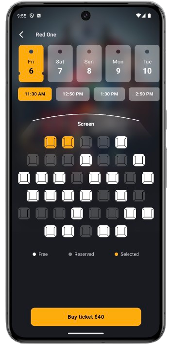

<h1 align="center">CineMate</h1>
<h2 align="center">Compose UI Movie App</h2>

<h3>Screenshots</h3>

    
    
    

<h3>Tech stacks</h3>
<ui>
  <li>Room database for local data save</li>
  <li>Hilt for dependency injection</li>
  <li>Data store for preference</li>
  <li>Compose navigation</li>
  <li>And some canvas drawings</li>
</ui>